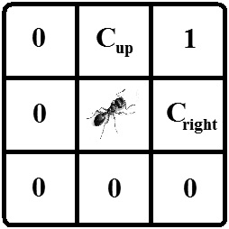
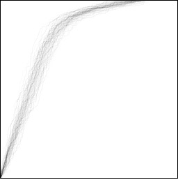
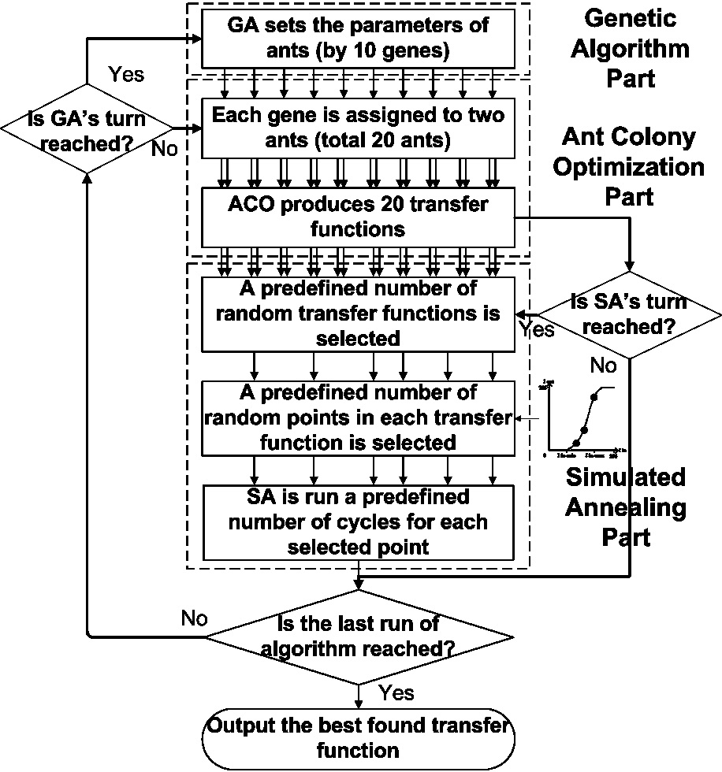
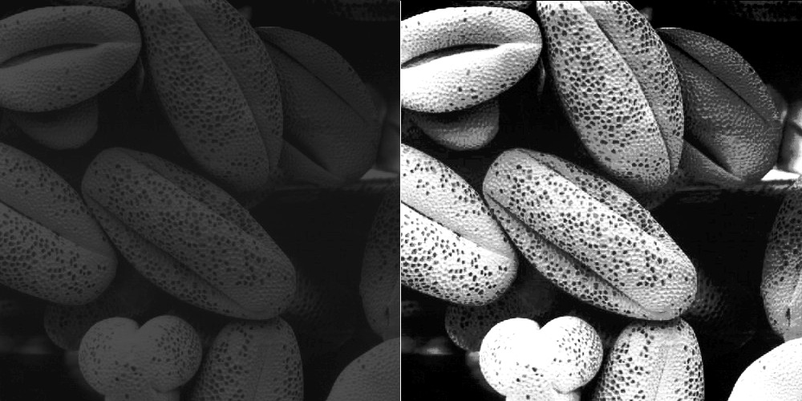
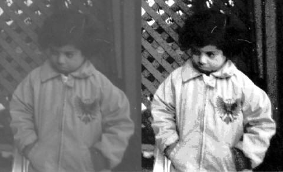

# Hybrid Ant Colony Optimization, Genetic Algorithm, and Simulated Annealing for Image Contrast Enhancement
The MATLAB code for enhancing the contrast of gray-scale images using nature-inspired methods can be found in this repo. The nature inspired methods are ant colony optimization, genetic algorithm, and simulated annealing, which generate a global transfer function to convert input images to higher contrast ones, while trying to keep the natural look of the images.

## Description
The details and thorough explanations of the image enhancer method are published in our papers: (Elsevier Digital Signal Processing: [pdf](docs/2013-DSP.pdf) or [ScienceDirect](https://doi.org/10.1016/j.dsp.2012.12.011) and (IEEE Congress on Evolutionary Computation: [pdf](2010-CEC.pdf) or [IEEE Xplore](https://doi.org/10.1109/CEC.2010.5586542)).

The method works by placing a few artificial agents (aka artificial ants) in a search space to generate a transfer function useful for converting any image to a higher contrast one. The ants start from the origin of the transfer function (bottom left) and move to the top right point of that.  Any ant probabilistically chooses among its available movement options, which are shown below:
<p align="center">
  
</p>

After reaching the last point, a transfer function is created and its fitness is evaluated. Based on how good is a transfer function, pheromones are deposited on the path the ants have travelled. Pheromone on a point increases the chance of an ant in the next iteration to choose passing over it when nearby. Here is an example of pheromone traces of ants after moving on a transfer function pane for a while.
<p align="center">
  
</p>

Each artificial ant has a genetic code during the process. The population of ants evolvs via genetic algorithm. This changes the characteristics of each ants and their preferences in traversing their path on a transfer function. After selecting the best transfer functions, the simulated annealing tries to fine tune the them in an artificial annealing process. This is the flowchart of the general steps in the method:
<p align="center">
  
</p>

After this process is finished, the best transfer function is selected and is used to convert the input image. Check these samples out:
<p align="center">
  
</p>
<p align="center">
  
</p>

## The Code
The MATLAB code in the file *imenhance.m*, under the *im-enhance* folder, contains the function to perform the image contrast enhancement. The function takes the input image and two optional arguments, one for the number of iterations and the other for disabling the simulated annealing to increase speed and probably at some performance cost.

# Citation
To refer to this work, you may cite the following papers:
```
@article{hoseini2013efficient,
  title={Efficient contrast enhancement of images using hybrid ant colony optimisation, genetic algorithm, and simulated annealing},
  author={Hoseini, Pourya and Shayesteh, Mahrokh G},
  journal={Digital Signal Processing},
  volume={23},
  number={3},
  pages={879--893},
  year={2013},
  publisher={Elsevier}
}
```
```
@inproceedings{hoseini2010hybrid,
  title={Hybrid ant colony optimization, genetic algorithm, and simulated annealing for image contrast enhancement},
  author={Hoseini, Pourya and Shayesteh, Mahrokh G},
  booktitle={IEEE Congress on Evolutionary Computation},
  pages={1--6},
  year={2010},
  organization={IEEE}
}
```

# Developers
[Pourya Hoseini](https://github.com/pouryahoseini)

# Contact
I can be reached at hoseini@nevada.unr.edu.